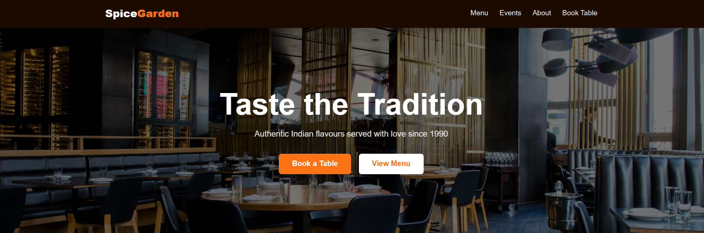
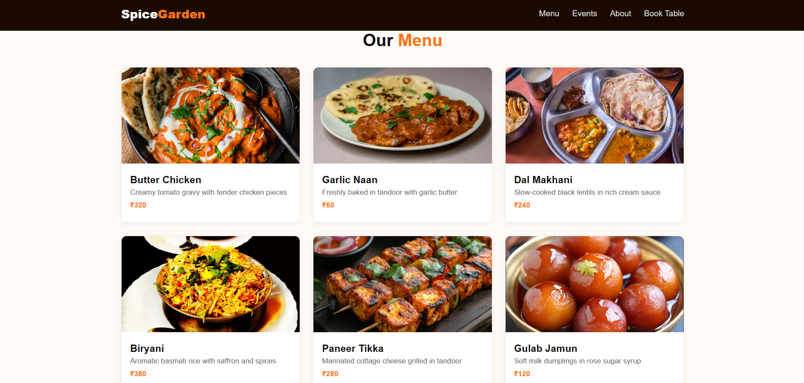
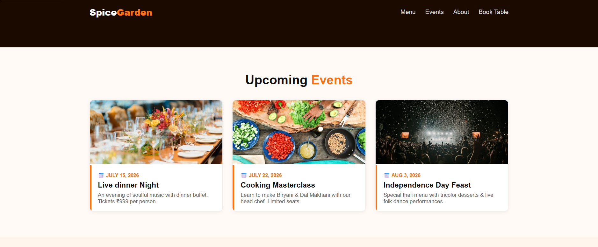
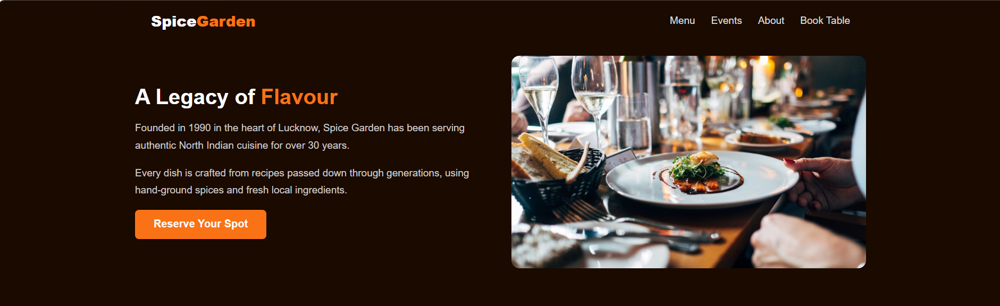
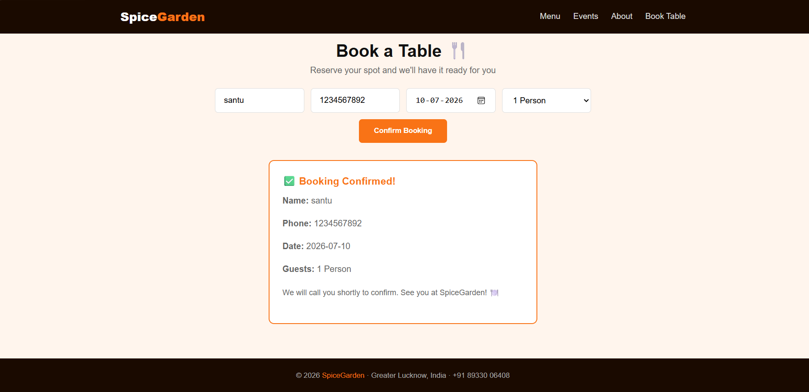

# Task 02 - Restaurant Website

## Description

A responsive Restaurant Website developed using HTML, CSS, and JavaScript. The website provides information about the restaurant, menu items, services, and contact details through an attractive and user-friendly interface.

## Features

* Responsive design for mobile and desktop devices
* Attractive homepage layout
* Food menu section
* About Us section
* Booking section
* Modern and interactive user interface

## Technologies Used

* HTML5
* CSS3
* JavaScript

## Screenshots

### Homepage

### Menu Section

### Events 

### About Us Section

### Booking Section

## Author

K.Santhoshini Mogaveera

